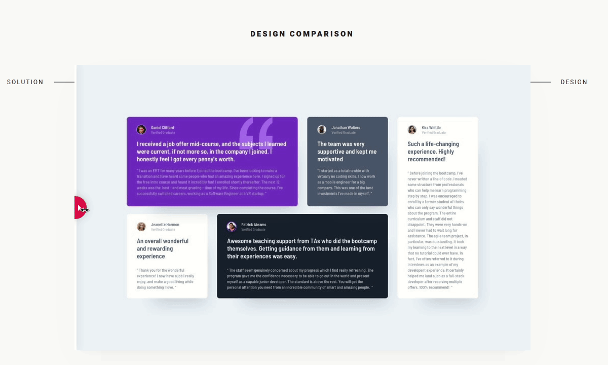

# Frontend Mentor - Testimonials grid section solution

This is a solution to the [Testimonials grid section challenge on Frontend Mentor](https://www.frontendmentor.io/challenges/testimonials-grid-section-Nnw6J7Un7). Frontend Mentor challenges help you improve your coding skills by building realistic projects.

## Table of contents

- [Overview](#overview)
  - [The challenge](#the-challenge)
  - [Screenshot](#screenshot)
  - [Links](#links)
- [My process](#my-process)
  - [Built with](#built-with)
  - [What I learned](#what-i-learned)
  - [Useful resources](#useful-resources)
- [Author](#author)

## Overview

This is the front-end mentor's ninth challenge. The challenge is to build the "Testimonials grid section" and make it as close to the design as possible. Building the desing with whatever you want to finish, any language, framework or tools.

### The challenge

Users should be able to:

- View the optimal layout for the site depending on their device's screen size

## Screenshot

### Mobile design

<p  align="center">
  </img>
</p>

### Tablets design

<p  align="center"></img></p>

### Desktop design

<p  align="center"></img></p>

<!-- ### result of my work

<p  align="center"></img></p>  -->

### Links

<!-- - Solution URL: [My solution for this challenge](https://www.frontendmentor.io/solutions/single-price-grid-with-reactjs-YR5dhXAtZ)
- Live Site URL: [check the result](https://jcdmeira-single-price.netlify.app) -->

- My figma design: [Figma](https://www.figma.com/file/kf4hMV4oJgVy46ZdniqSJl/09-testimonial-grid?node-id=0%3A1)

## My process

### Built with

- Flex box
- CSS Grid
- Grid template areas
- Mobile-first workflow
- [Styled components](https://styled-components.com) - CSS in js with stiled components
- [React](https://reactjs.org/) - JS library

### What I learned

CSS in JS with styled components

```JS
import styled, { createGlobalStyle } from 'styled-components';

export const GlobalStye = createGlobalStyle`
  *{
    margin: 0;
    padding: 0;
    box-sizing: border-box;
  }

  html{
    font-size: 62.5%;
    font-family: 'Barlow Semi Condensed';
  }
}
`;

```

import style (CSS reset)

```JSX
import { GlobalStye } from './global';
function App() {
  return (
    <>
      <GlobalStye />
      .
      .
      .
    </>
  );
}

export default App;
```

Passing dynamic properties through props

```JSX
<Card
  background="#7541C8"
  height="44.4"
>
</Card>
```

Using props with styled components

```js
import styled from 'styled-components';

export const Fieldcard = styled.div`
  background: ${(props) => props.background};
  height: ${(props) => `${props.height}rem`};
`;
```

### Useful resources

- [react tutorial](https://pt-br.reactjs.org/tutorial/tutorial.html) - This helped me structure the components and build the proposed page.
- [my figma design](https://www.figma.com/file/kf4hMV4oJgVy46ZdniqSJl/09-testimonial-grid?node-id=0%3A1) - My figma design for help anyone who wants to build this challenge.
- [CSS units conversor - px to VH/VW/REM](https://it-news.pw/pxtovh/) - CSS units conversor .
- [Converting Colors](<https://convertingcolors.com/hsl-color-179_62_43.html?search=HSL(179°,%2062%,%2043%)>) - HSL for all color systems.
- [Typechecking](https://pt-br.reactjs.org/docs/typechecking-with-proptypes.html) - Typechecking with PropTypes.
- [CSS reset with stiled components](https://stackoverflow.com/questions/62887728/how-do-you-reset-the-css-in-react-if-youre-doing-styled-components) - Reset the CSS in React with styled components.
- [grid-areas in stiled components](https://stackoverflow.com/questions/56900826/how-do-i-use-grid-template-areas-in-styled-components-with-react) - How to use grid-template-areas with styled components
- [grid-template-columns](https://developer.mozilla.org/pt-BR/docs/Web/CSS/grid-template-columns) - Difine the vertical track in a css grid layout.

## Author

- Personal Page - [Jean Carlos De Meira](https://jcdmeira.github.io)
- Frontend Mentor - [@JCDMeira](https://www.frontendmentor.io/profile/JCDMeira)
- Instagram - [@jean.meira10](https://www.instagram.com/jean.meira10/)
- GitHub - [JCDMeira](https://github.com/JCDMeira)
